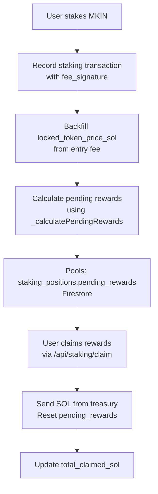
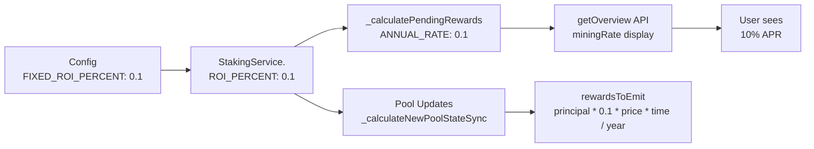

# Staking Reward Rate Migration Analysis Plan

**Date:** 2025-02-09
**Status:** DRAFT
**Objective:** State migration from 30% APR to 10% APR with proper rewards backfill

---

## Executive Summary

Users lost their already-mined but unclaimed rewards when the staking rate was switched from **30% APR to 10% APR**. This is a **state migration problem** — we need to:
1. Snapshot what users earned at the 30% rate before the change
2. Transition them to the new 10% rate going forward
3. Ensure no overpayment or lost rewards

**Current Pool Balance:** ~8.9 SOL available
**Risk:** Unknown total liability from 30%-era unclaimed rewards

---

## 1. Architecture Analysis

### Current Staking System Components

| Component | Location | Current Rate | Notes |
|-----------|----------|--------------|-------|
| Backend Rate | [`backend-api/services/stakingService.js:130`](backend-api/services/stakingService.js:130) | `ROI_PERCENT = 0.1` (10%) | Used in pool state updates |
| Backend Rate | [`backend-api/services/stakingService.js:185`](backend-api/services/stakingService.js:185) | `ROI_PERCENT = 0.1` (10%) | Used in `_calculatePendingRewards` |
| Frontend Config | [`realmkin/src/config/staking.config.ts:6`](realmkin/src/config/staking.config.ts:6) | `FIXED_ROI_PERCENT: 0.1` (10%) | Display and calculation base |
| Legacy Rate | [`backend-api/scripts/audit_locked_prices.js:39`](backend-api/scripts/audit_locked_prices.js:39) | `0.3` (30%) | Used in audit scripts only |
| Legacy Rate | [`backend-api/scripts/calculate_final_reward.js:55`](backend-api/scripts/calculate_final_reward.js:55) | `ROI_PERCENT = 0.3` (30%) | Used in final reward calculation script |

### Reward Calculation Flow



### Key Formula

**Current Reward Calculation** ([`backend-api/services/stakingService.js:2150-2229`](backend-api/services/stakingService.js:2150-2229)):

```javascript
pendingRewards = max(0, totalRewards - totalClaimedSol)
where:
  totalRewards = (principal * 0.1 * lockedPriceSol * secondsStaked) / SECONDS_PER_YEAR * boosterMultiplier
  totalClaimedSol = positionData.total_claimed_sol || 0
```

**Previously (30% era):**
```javascript
totalRewards = (principal * 0.3 * lockedPriceSol * secondsStaked) / SECONDS_PER_YEAR * boosterMultiplier
```

**The Problem:**
- Rewards are calculated in **real-time** using current rate (0.1)
- `locked_token_price_sol` was backfilled from entry fees during 30% era
- When rate switched to 10%, the calculation immediately uses 0.1 instead of 0.3
- **Users lost the difference between what they earned at 30% and what's now calculated at 10%**

---

## 2. Damage Assessment Plan

### 2.1 Snapshot Required Data

For each user with a staking position, we need:

| Field | Source | Description |
|-------|--------|-------------|
| `user_id` | `staking_positions` | Firebase ID |
| `principal_amount` | `staking_positions.principal_amount` | Tokens staked |
| `stake_start_time` | `staking_positions.stake_start_time` | When staking began (timestamp) |
| `last_stake_time` | `staking_positions.last_stake_time` | Most recent stake |
| `locked_token_price_sol` | `staking_positions.locked_token_price_sol` | Token price at stake time (from backfill) |
| `total_claimed_sol` | `staking_positions.total_claimed_sol` | Already claimed rewards |
| `booster_multiplier` | `staking_positions.active_boosters` | Booster status (1.0-2.0x) |
| `transaction_history` | `staking_transactions` | All stake transactions with timestamps |

### 2.2 Rate Change Timestamp

**Unknown** — Need to determine when the rate was changed from 30% to 10%.

**Evidence:**
- Legacy scripts use 0.3 (30%)
- Current code uses 0.1 (10%)
- `locked_token_price_sol` backfill suggests a migration occurred

**Action Required:**
1. Check git history for rate change commit
2. Ask user when the change was made
3. Use timestamp as cutoff point for 30%-era vs 10%-era calculations

### 2.3 Calculation Methodology

**For each user position:**

1. **Time spent at 30% rate:**
   - If `stake_start_time` < `rate_change_time`: period at 30%
   - Rate change time = unknown (need to determine)
   - `seconds_at_30 = min(rate_change_time, now) - stake_start_time`

2. **Rewards earned at 30% rate:**
   ```
   rewards_30 = (principal * 0.3 * lockedPriceSol * seconds_at_30) / SECONDS_PER_YEAR * boosterMultiplier
   ```

3. **Time spent at 10% rate:**
   - If `last_stake_time` > `rate_change_time`: period at 10%
   - `seconds_at_10 = now - max(rate_change_time, stake_start_time)`

4. **Rewards earned at 10% rate (post-change):**
   ```
   rewards_10_post = (principal * 0.1 * lockedPriceSol * seconds_at_10) / SECONDS_PER_YEAR * boosterMultiplier
   ```

5. **Total claimable rewards:**
   ```
   total_claimable = rewards_30 + rewards_10_post - total_claimed_sol
   ```

---

## 3. Liability Calculation Plan

### 3.1 Data Collection Script

Create `scripts/analyze_30pct_rewards.js`:

```javascript
// Analyzes pending rewards earned at 30% rate vs 10% rate
// Output: Full summary and per-user breakdown
```

**Queries:**
1. All users with `staking_positions` documents
2. Transaction history timestamps to infer rate change time
3. Current pool balance from `staking_pool.reward_pool_sol`

**Outputs:**
- `analysis-summary.json` - Aggregated totals
- `per-user-breakdown.csv` - Detailed user-level data
- `console report` - Human-readable summary

### 3.2 Pool Balance Check

**Steps:**

1. Fetch current `staking_pool.reward_pool_sol` balance
2. Sum total of all unclaimed 30%-era rewards
3. Compare pool balance vs. total liability
4. Calculate shortfall if any

---

## 4. Trimming Options (If Pool Insufficient)

### Option 1: Proportional Trimming

**Approach:** Reduce all 30%-era rewards by same percentage to fit pool budget.

**Math:**
```
total_liability = Σ rewards_30_earned
pool_available = 8.9 SOL
reduction_ratio = pool_available / total_liability
adjusted_rewards_30 = rewards_30_earned * reduction_ratio
```

**Pros:**
- Fair - all users treated equally
- Simple calculation
- Preserves relative reward differences

**Cons:**
- Users feel they earned X but get less
- May demotivate early adopters
- Complex to explain to users

**Example:**
- User A earned 1.0 SOL at 30%, gets paid 0.8 SOL (20% cut)
- User B earned 0.2 SOL at 30%, gets paid 0.16 SOL (20% cut)
- Same users, different absolute but same proportional cut

### Option 2: Cap Per-User Maximum

**Approach:** Set maximum payout per user to fit pool, paying earliest claimants first.

**Math:**
```
max_per_user = pool_budget / number_of_users
adjusted_rewards_30 = min(rewards_30_earned, max_per_user)
```

**Pros:**
- Predictable maximum cost
- Protects pool from exhaustion
- Incentivizes early claiming

**Cons:**
- Late claimers may get nothing
- Unfair to users who can't claim immediately
- Could cause claim rush when announced

**Example:**
- Pool: 8.9 SOL, Users: 100, Max per user: 0.089 SOL
- User A earned 0.2 SOL → gets full 0.089 SOL (still under max)
- User B earned 0.05 SOL → gets full 0.05 SOL
- User C earned 0.15 SOL → gets 0.089 SOL (capped, loses 0.061 SOL)

### Option 3: Phase-In Payouts

**Approach:** Spread payments over time as pool grows from entry fees.

**Math:**
```
current_pool = 8.9 SOL
total_liability = 50 SOL
monthly_payout = current_pool * entry_fee_rate / SECONDS_IN_MONTH
```

**Pros:**
- Pool self-heals from new stakes
- No user loses rewards (just delayed)
- Sustainable long-term

**Cons:**
- Users wait longer for rewards
- Complex payout scheduling required
- Requires trusting continued pool growth

**Example:**
- Pool earns 0.5 SOL/month from new stakes
- 8.9 SOL can pay out at current rate for ~18 months
- 50 SOL liability would take ~8+ years at current rate

---

## 5. Rate Verification Plan

### 5.1 Config → Calculation → Execution Trace



### 5.2 Verification Steps

1. **Config Check:**
   - Verify `realmkin/src/config/staking.config.ts:FIXED_ROI_PERCENT = 0.1`

2. **Backend Calculation:**
   - Verify `backend-api/services/stakingService.js:130:ROI_PERCENT = 0.1`
   - Verify `backend-api/services/stakingService.js:185:ROI_PERCENT = 0.1`
   - Verify `_calculatePendingRewards` uses `ANNUAL_RATE = 0.1`

3. **Runtime Output:**
   - Call `/api/staking/overview` and check:
     - `config.apr === 10`
     - `config.roiPercent === 0.1`
   - Check console logs for:
     - "💰 Pool update" messages showing 10% calculations
     - "⛱️ Pending rewards calculated" using 10% rate

4. **Test User:**
   - Create test stake with known amount
   - Verify mining rate shows correct 10% calculation
   - Verify pending rewards match manual calculation

---

## 6. State Migration Solution Design

### 6.1 Core Concept

**Snapshot & Transition Pattern:**

```
          Rate Change (unknown date)
                 │
    ┌────────┴────────┐
    │                    │
    ▼                    ▼
30-era (0.3)         10-era (0.1)
    │                    │
    ▼                    ▼
Snapshot              Calculate
Rewards_30           Rewards_10
    │                    │
    └────────┬────────┘
             │
             ▼
        Adjusted Rewards
             │
        (based on trim option)
             │
             ▼
        Update Positions
             │
             ▼
    total_claimed_sol includes snapshot
```

### 6.2 Database Schema Changes

**New Field in `staking_positions`:**

| Field | Type | Purpose |
|-------|------|---------|
| `rate_30_earned_sol` | number | Rewards earned at 30% rate (accumulated) |
| `rate_10_earned_sol` | number | Rewards earned at 10% rate (from migration point) |
| `migration_timestamp` | timestamp | When migration was executed |
| `migration_rate_version` | string | "0.1" to indicate post-migration status |

**Alternative (simpler):**

| Field | Type | Purpose |
|-------|------|---------|
| `legacy_adjusted_rewards_sol` | number | Adjusted 30%-era rewards (applied trim) |
| `total_rewards_30pct_adjusted` | boolean | Flag indicating adjustment was made |

### 6.3 Migration Script Structure

```javascript
// scripts/migrate-to-10pct-rewards.js

async function main() {
  // Phase 1: Analyze (dry run)
  // Phase 2: Execute migration
  // Phase 3: Verify results
}
```

---

## 7. Execution Plan

### Phase 1: Analysis (Read-Only)

**Steps:**
1. Create `scripts/analyze_30pct_rewards.js`
2. Run analysis to collect:
   - Total users staking
   - Sum of all unclaimed 30%-era rewards
   - Pool balance check
   - Per-user breakdown
3. Generate report with recommendations

**Deliverables:**
- Full JSON analysis data
- CSV export for spreadsheet review
- Console summary report
- Recommendation on which trim option to use (or if trimming is even needed)

### Phase 2: Verification

**Steps:**
1. Run rate verification script
2. Test on 2-3 known users manually
3. Verify calculations match expectations
4. Confirm pool balance is sufficient

### Phase 3: Implementation

**Steps:**
1. Create migration script based on chosen trim option
2. Test migration on staging/dev environment
3. Create backup of `staking_positions` before migration
4. Execute migration
5. Verify post-migration calculations
6. Update documentation

### Phase 4: Deployment

**Steps:**
1. Generate migration report
2. Notify users of upcoming changes
3. Execute live migration during low-traffic period
4. Monitor for errors
5. Post-launch verification

---

## 8. Risk Assessment

| Risk | Probability | Impact | Mitigation |
|------|--------------|--------|------------|
| Pool insufficient | Medium | High | Analyze first; trim if needed |
| Calculation errors | Low | Critical | Dry run; double-check math |
| User confusion | Medium | Medium | Clear communication before/during |
| Migration fails mid-exec | Low | Critical | Batch processing with rollback capability |

---

## 9. Next Steps

1. **Immediate:**
   - Determine rate change timestamp
   - Run analysis script to assess damage

2. **Conditional:**
   - If pool insufficient: Present trimming options with tradeoff analysis
   - If calculations verify 10% rate: Proceed to migration design

3. **After Analysis:**
   - Choose trim approach
   - Design and test migration script
   - Execute migration

---

## Appendix: Key Code References

### Current Rate Implementation

**Backend:**
- [`backend-api/services/stakingService.js:130`](backend-api/services/stakingService.js:130) - ROI_PERCENT constant
- [`backend-api/services/stakingService.js:185`](backend-api/services/stakingService.js:185) - ROI_PERCENT in pool calculation
- [`backend-api/services/stakingService.js:2197`](backend-api/services/stakingService.js:2197) - ANNUAL_RATE in pending rewards

**Frontend:**
- [`realmkin/src/config/staking.config.ts:6`](realmkin/src/config/staking.config.ts:6) - FIXED_ROI_PERCENT constant
- [`realmkin/src/config/staking.config.ts:45-59`](realmkin/src/config/staking.config.ts:45-59) - calculateMiningRewards function

**Legacy (30% evidence):**
- [`backend-api/scripts/audit_locked_prices.js:39`](backend-api/scripts/audit_locked_prices.js:39) - 0.3 in daily reward calculation
- [`backend-api/scripts/calculate_final_reward.js:55`](backend-api/scripts/calculate_final_reward.js:55) - ROI_PERCENT = 0.3 constant

---

**Document Version:** 1.0
**Last Updated:** 2025-02-09
**Author:** Analysis Team
